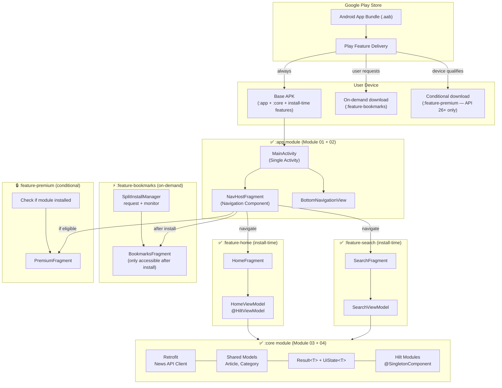
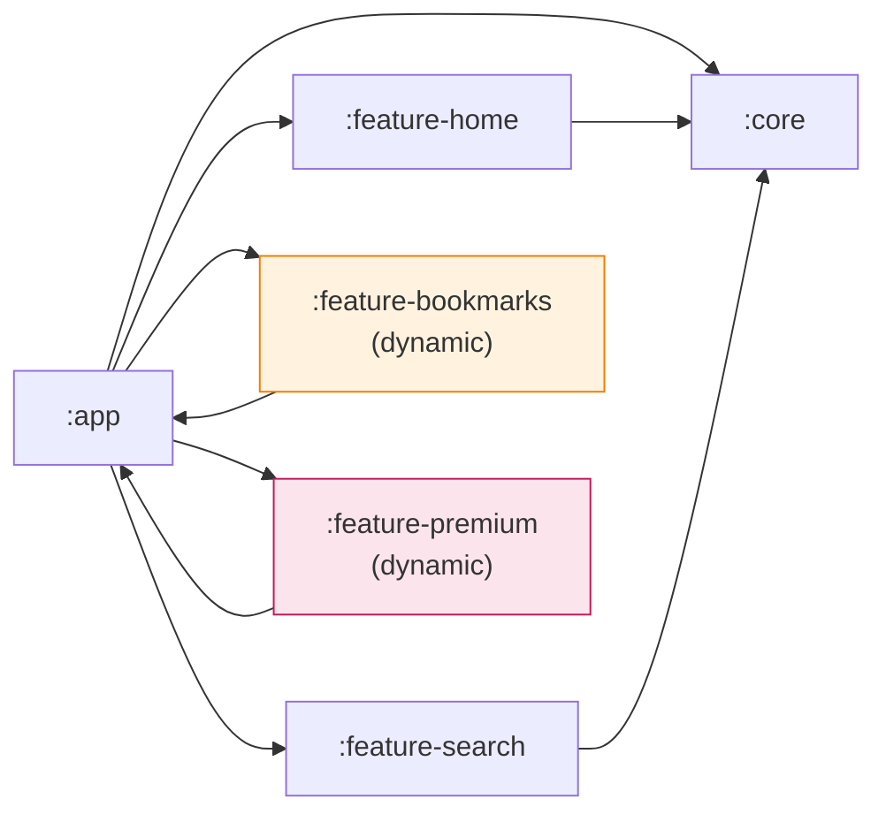

# High Level Design — Android Modular Learning Project

This diagram shows the complete architecture of the News Reader app across all 7 modules.
Each layer builds on the previous — from Gradle setup to a signed AAB with dynamic delivery.

---

## Module Dependency Rules

> **Key rule:** Feature modules depend on `:core`, never on each other.
> Dynamic feature modules depend on `:app` (reverse of library modules).

---

## Delivery Mode Summary

| Module | Gradle plugin | Delivery | Downloaded |
|--------|--------------|----------|-----------|
| `:app` | `com.android.application` | Always | At install |
| `:core` | `com.android.library` | Always (merged into base) | At install |
| `:feature-home` | `com.android.library` | Install-time | At install |
| `:feature-search` | `com.android.library` | Install-time | At install |
| `:feature-bookmarks` | `com.android.dynamic-feature` | On-demand | When user requests |
| `:feature-premium` | `com.android.dynamic-feature` | Conditional | If API >= 26 |
