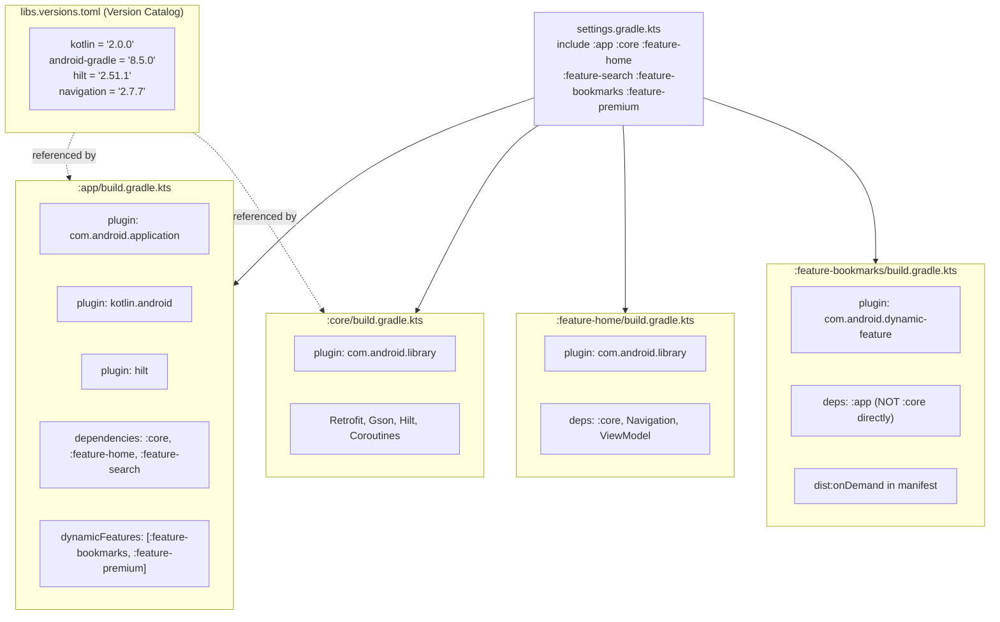
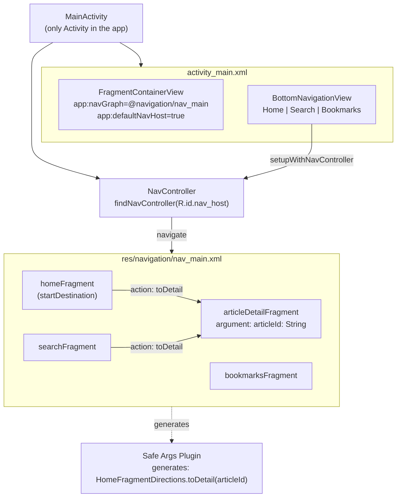
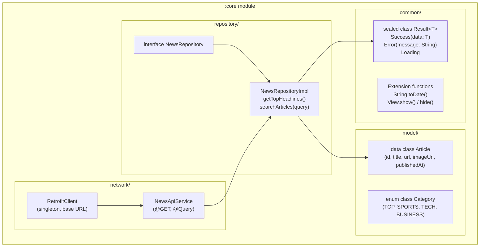
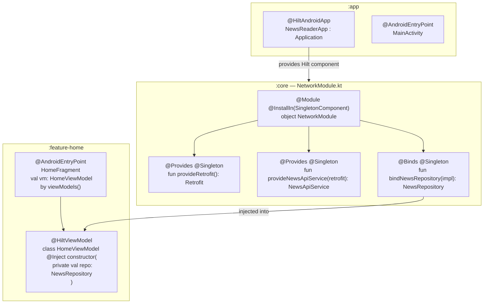
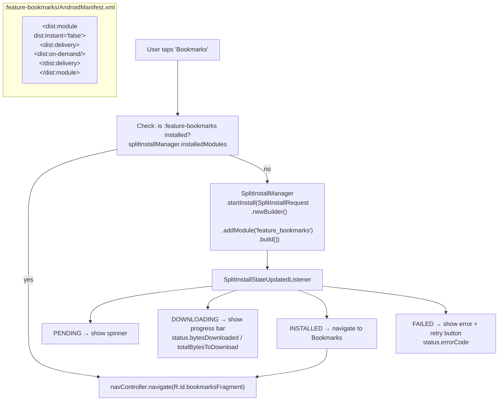
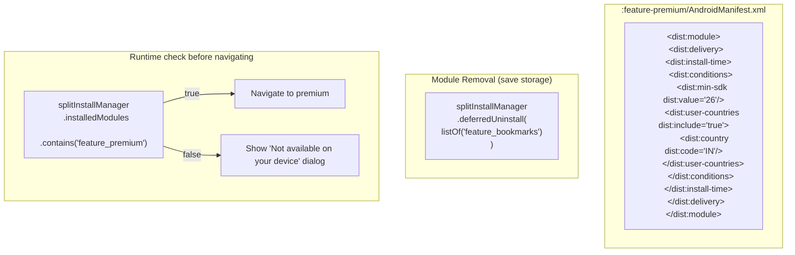
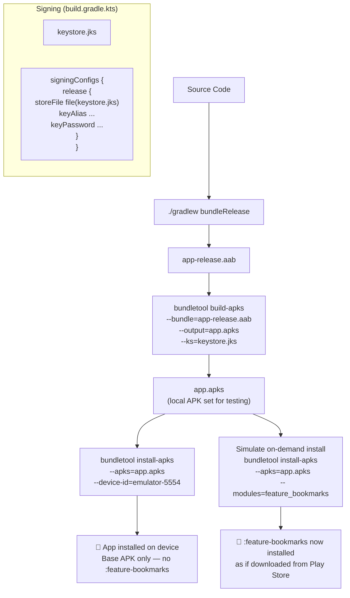

# Low Level Design — Per Module Detail

---

## Module 01 — Multi-Module Project Setup

**Key files:** `settings.gradle.kts`, `libs.versions.toml`, per-module `build.gradle.kts`

---

## Module 02 — Single Activity & Navigation

**Key files:** `activity_main.xml`, `nav_main.xml`, `build.gradle.kts` (safeargs plugin)

---

## Module 03 — Core Module & Shared Architecture

**Key files:** `RetrofitClient.kt`, `NewsApiService.kt`, `Article.kt`, `Result.kt`, `NewsRepository.kt`

---

## Module 04 — Hilt DI (Multi-Module)

**Key files:** `NewsReaderApp.kt`, `NetworkModule.kt`, `HomeViewModel.kt`, `HomeFragment.kt`

---

## Module 05 — Play Feature Delivery (On-Demand)

**Key files:** `BookmarkInstallViewModel.kt`, `SplitInstallManager`, `:feature-bookmarks/AndroidManifest.xml`

---

## Module 06 — Conditional Delivery & Module Removal

**Key files:** `:feature-premium/AndroidManifest.xml`, `PremiumEntryViewModel.kt`

---

## Module 07 — Build, Sign & Ship AAB

**Key files:** `build.gradle.kts` (signingConfigs), `keystore.jks`, `bundletool` CLI
