# Low Level Design — Per Module Detail

> Jump to: [Module 08 — Local Gen AI](#module-08--local-gen-ai-mediapipe--gemini-nano)

---

## Module 01 — Multi-Module Project Setup

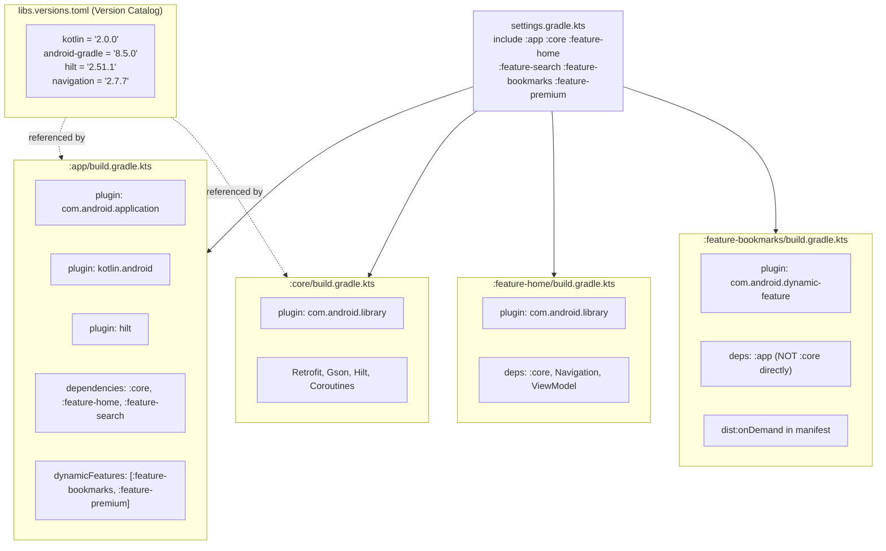

**Key files:** `settings.gradle.kts`, `libs.versions.toml`, per-module `build.gradle.kts`

---

## Module 02 — Single Activity & Navigation

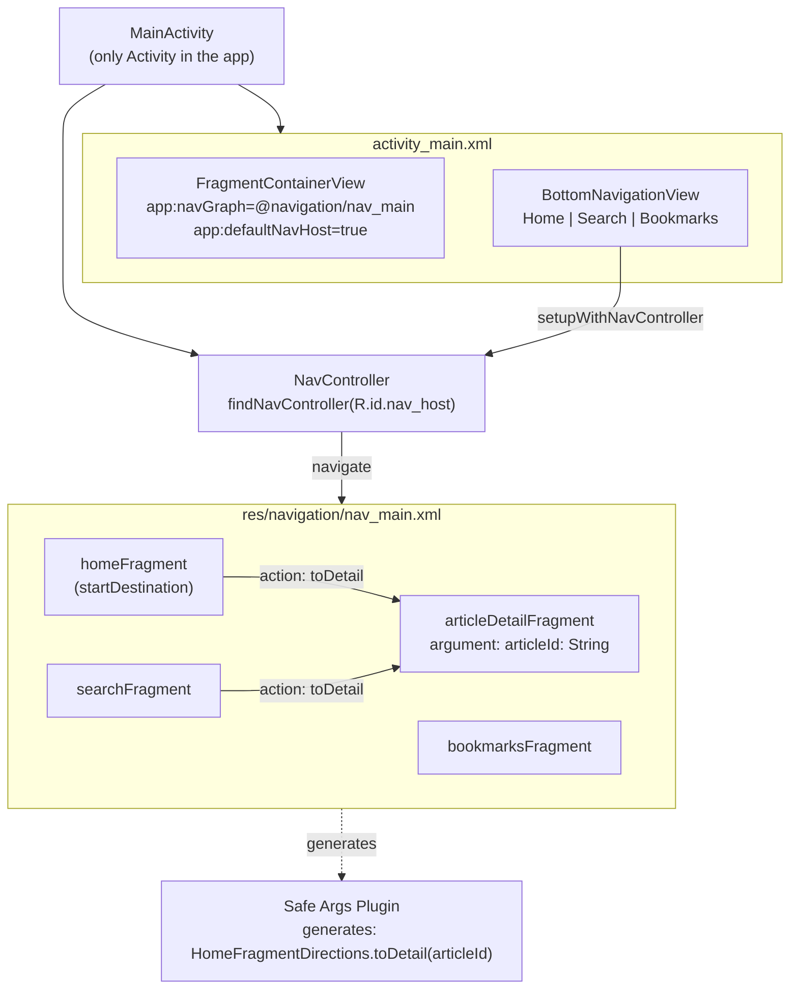

**Key files:** `activity_main.xml`, `nav_main.xml`, `build.gradle.kts` (safeargs plugin)

---

## Module 03 — Core Module & Shared Architecture

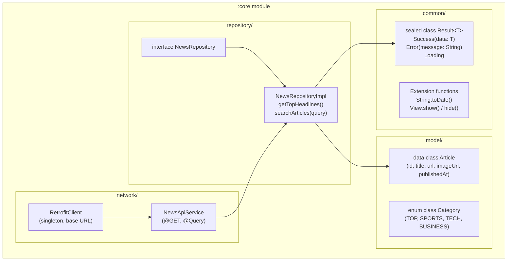

**Key files:** `RetrofitClient.kt`, `NewsApiService.kt`, `Article.kt`, `Result.kt`, `NewsRepository.kt`

---

## Module 04 — Hilt DI (Multi-Module)

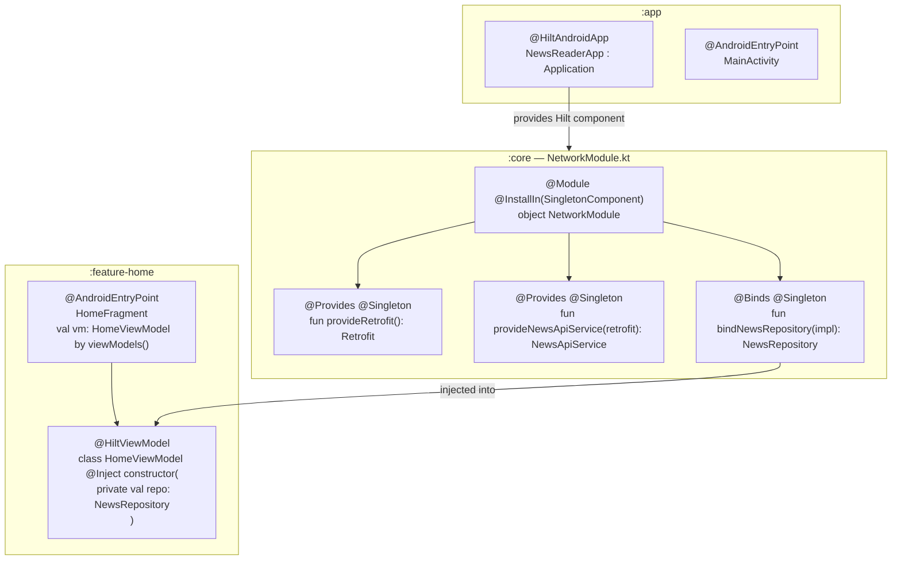

**Key files:** `NewsReaderApp.kt`, `NetworkModule.kt`, `HomeViewModel.kt`, `HomeFragment.kt`

---

## Module 05 — Play Feature Delivery (On-Demand)

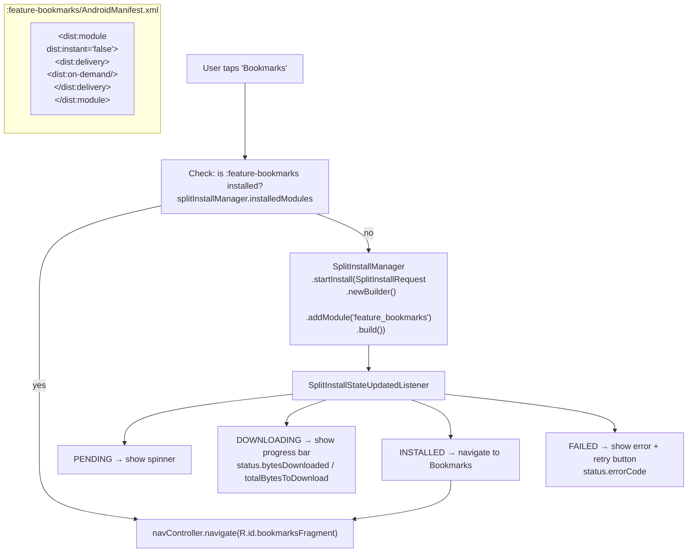

**Key files:** `BookmarkInstallViewModel.kt`, `SplitInstallManager`, `:feature-bookmarks/AndroidManifest.xml`

---

## Module 06 — Conditional Delivery & Module Removal

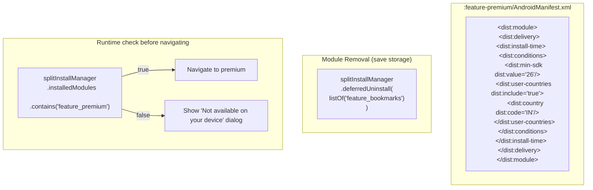

**Key files:** `:feature-premium/AndroidManifest.xml`, `PremiumEntryViewModel.kt`

---

## Module 07 — Build, Sign & Ship AAB

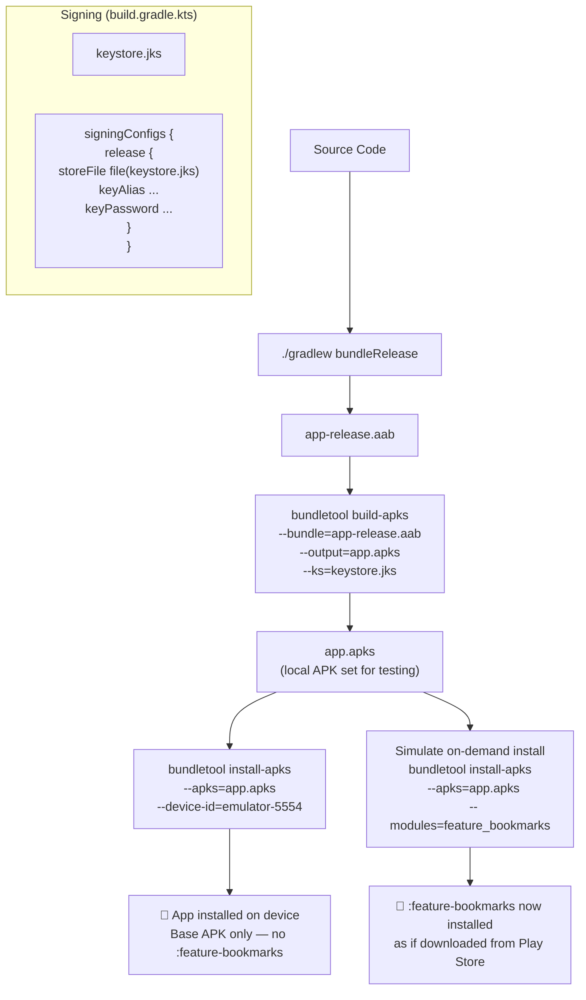

**Key files:** `build.gradle.kts` (signingConfigs), `keystore.jks`, `bundletool` CLI

---

## Module 08 — Local Gen AI (MediaPipe + Gemini Nano)

### Two on-device AI paths

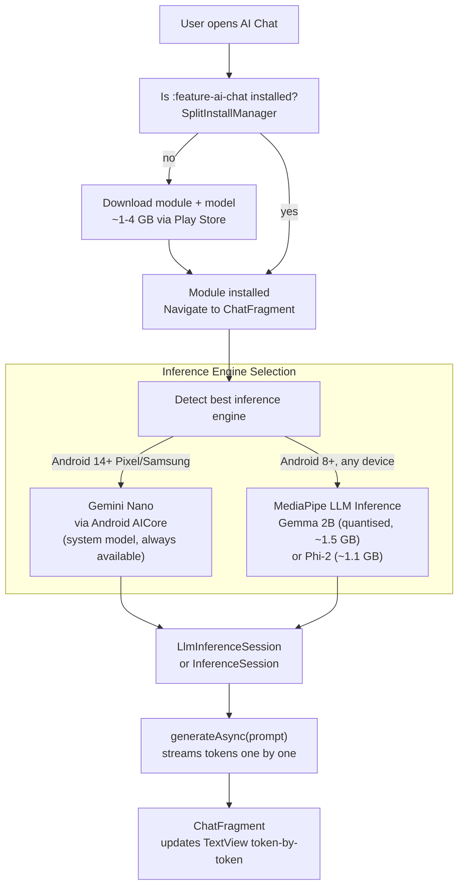

---

### MediaPipe LLM Inference flow

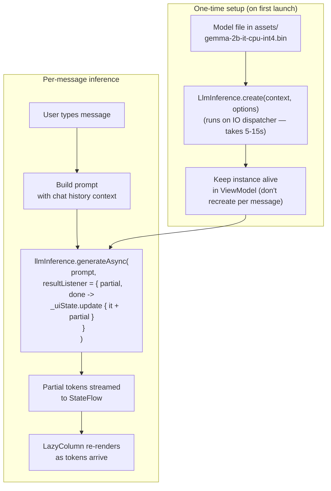

---

### Gemini Nano (AICore) flow — Android 14+

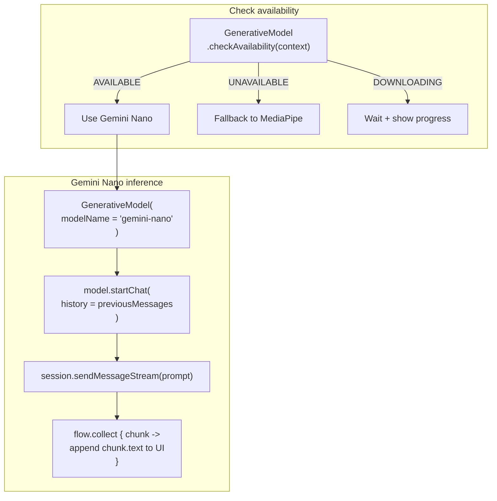

---

### Architecture of :feature-ai-chat

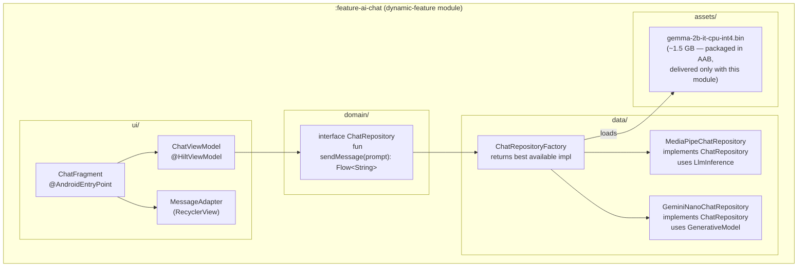

---

### Memory & performance rules

| Rule | Why |
|------|-----|
| Load model once in ViewModel, not per message | Model init takes 5–15s and uses ~1.5 GB RAM |
| Run inference on `Dispatchers.IO` | LLM inference blocks the thread — never run on Main |
| Use `generateAsync` with streaming | User sees response immediately, not after full generation |
| Clear model in `onCleared()` | Release RAM when user leaves the screen |
| Quantised INT4 model (not FP32) | ~4x smaller file, ~3x faster, minimal quality loss |
| Show RAM warning if device < 4 GB | Gemma 2B needs ~2 GB free RAM to run |

---

### AndroidManifest for :feature-ai-chat

```xml
<manifest xmlns:android="http://schemas.android.com/apk/res/android"
    xmlns:dist="http://schemas.android.com/apk/distribution">

    <!-- On-demand: downloaded only when user opens AI Chat -->
    <dist:module
        dist:instant="false"
        dist:title="@string/title_feature_ai_chat">
        <dist:delivery>
            <dist:on-demand />
        </dist:delivery>
        <dist:fusing dist:include="true" />
    </dist:module>

</manifest>
```

**Key files:** `ChatFragment.kt`, `ChatViewModel.kt`, `MediaPipeChatRepository.kt`,
`GeminiNanoChatRepository.kt`, `ChatRepositoryFactory.kt`, `feature-ai-chat/AndroidManifest.xml`
